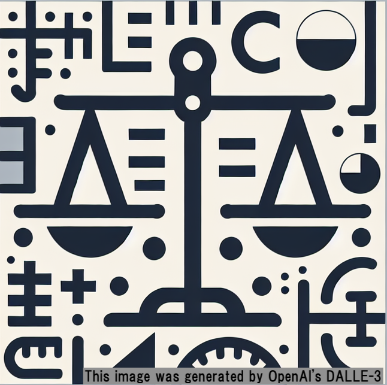

---

---

     
# WhatStandard

This is a single turn chatbot to ask a consensus of a treatment based on pooled guidelines of a specific disorder

## The construction
A basic image of the RAG process is here.

$$ QRV = BM25_{standerdized}/rank_{BM25}+cosine_{standerdized}/rank_{cosine}$$